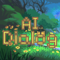

# Godot AI Dialog Plugin

<p align="center">
	
</p>

This Godot plugin helps with creating **AI generated dialogs for free!** Use it in RPG (dynamic quest assigning also possible) or bring your NPCs to life.

Here is a simple example of how it works.
1. Update the Project Settings via the UI or *Project Settings* to add your API token, API model and API URL.

**Recommended API**: [openrouter.ai](https://openrouter.ai/)<br> 
**Recommended Settings to use FREE good AI LLM model** (creation of [token](https://openrouter.ai/settings/keys) is free). If you already have OpenAI API access then change the URL, model and token with OpenAI credentials and it will work.
```py
api_model = "meta-llama/llama-3.3-70b-instruct:free"
api_url= "https://openrouter.ai/api/v1/chat/completions"
api_token = "your token from openrouter"
```

and use
```gdscript
var NPC = DialogManager.new()
add_child(NPC)

# Each NPC needs a personality to start. Without personality the NPC will not respond properly.
NPC.add_personality("You are an NPC in a game world where the player can interact with you. You are a farmer in a medival world. Give small answers.")

# Add quests
NPC.provide_context("Player will come to you for quests. Talk to them normally while also giving them the quest of collecting 100 honey pots for you. Make up a story for why you need it.")

# Get a reply when the player said something
var response:String = await NPC.generate_dialog("This is something the Player will say. something like a dialog or fixed choice or even processed speech recognization, possibilities are endless")

#print response or something with it
print(response)
```

## Demo project
You can find a working demo (if you add your own token of openrouter.ai) here: [krishsharma0413/godot-AI-Dialog-demo](https://github.com/krishsharma0413/godot-AI-Dialog-demo)